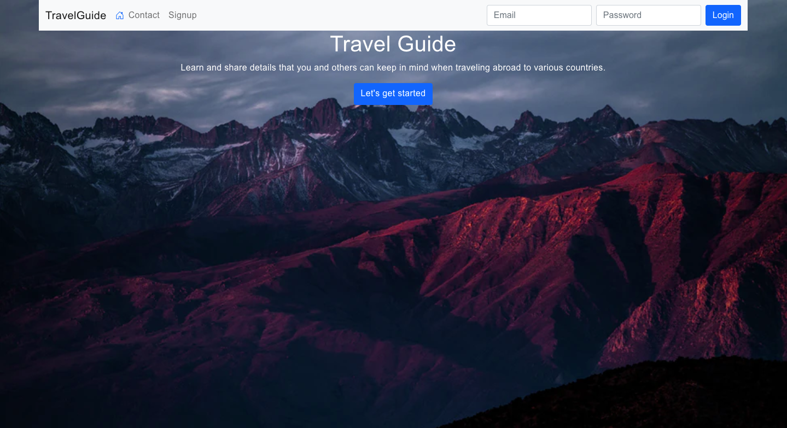

# TravelGuideApp

## Author:
Bernard Ekezie

# Project Objective:
A website where people can post information about things to keep in mind when traveling abroad to various countries.

For example:
The user will choose a country from the given list of countries. Once a country is selected user will be redirected to another page that displays a timeline that highlights existing content about the country. Content will include what to expect and be mindful of when visiting the country. This content is posted by previous users if any.

Current users can then choose whether they would like to enter their own thoughts on what to expect when visiting this country and post to the timeline. This updates the timeline. The current user’s post will be present when the next user wants to learn about things to keep in mind when traveling to that specific country and so on.

1. User Authentication(Register/Login)
2. Users can post/publish what to expect when traveling to a specific country and then save it in the database.
3. Users can view existing countries’ information.

Homepage

## Instructions to build:

-Clone the repository

Ensure that you have installed locally:
- Node.js
- MongoDB

-Do 'npm install' at root. Also cd into the TravelGuide folder and do 'npm install'

-Start backend and frontend servers with 'npm start' in root.

-Go to localhost:3000 to see the website!

Demo video: https://www.youtube.com/watch?v=TCLIWiWJOCc&ab_channel=BernardEkezie
